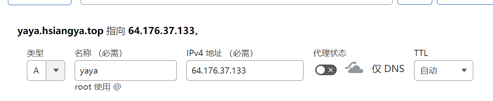
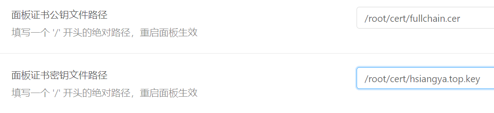
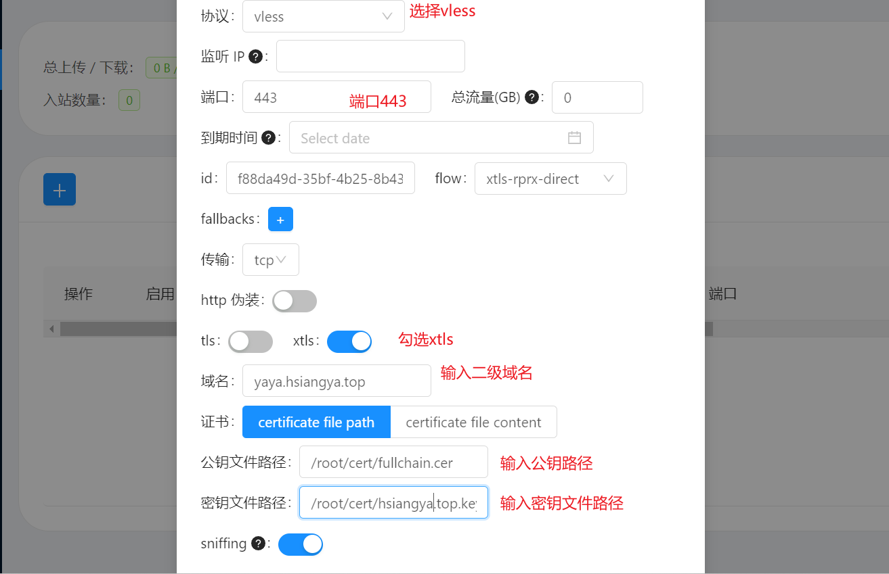

# 2023/1搭建

## 流程

1. 申请购买域名(https://www.namesilo.com/)
2. 接管域名解析(https://dash.cloudflare.com/)
3. 购买虚拟服务器(https://my.vultr.com/)
4. 配置服务器

## 接管域名

## 配置

1. 进入服务器，安装x-ui

   ```bash
   #更新包
   apt update -y
   apt install -y curl socat
   
   # 安装x-ui
   bash <(curl -Ls https://raw.githubusercontent.com/vaxilu/x-ui/master/install.sh)
   
   # 放行443端口和自己设定的端口
   iptables -I INPUT -p tcp --dport 443 -j ACCEPT
   iptables -I INPUT -p tcp --dport 自定义的端口 -j ACCEPT
   iptables -I INPUT -p tcp --dport 19999 -j ACCEPT
   iptables -I INPUT -p tcp --dport 44828 -j ACCEPT
   ```

2. 安装时需要设置账号、密码、端口

3. 终端一键申请SSL证书，需要属于一级域名、邮箱号、API密钥

   ```bash
   # 申请证书
   x-ui # x-ui后选择编号16
   ```

4. cloudflare网站上添加一个二级域名，取消代理选项

   

5. 在浏览器通过IP:端口号访问后台系统

6. 点击面板设置，添加公钥文件路径和证书密钥路径，并保存配置

   

7. 浏览器通过二级域名:端口号访问服务器后台

8. 入站列表中添加节点，并配置信息

   

9. 点击节点操作，选择二维码，即可订阅链接

## 工具下载地址

FinalShell下载：https://wa6.lanzoui.com/ihjg2y3h14j
FinalShell备用下载（含MAC版）：https://drive.google.com/drive/folders/1yUKRCn58kzDM6FRIadIWO8e5cDLz1mrx?usp=sharing

科学软件下载：https://bit.ly/2MXgZ4U
域名注册和解析教程：https://youtu.be/SjSmvQLEOEE