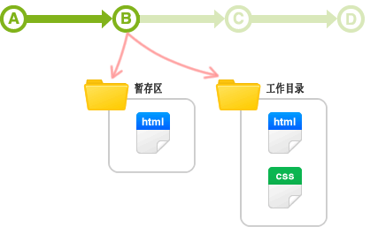
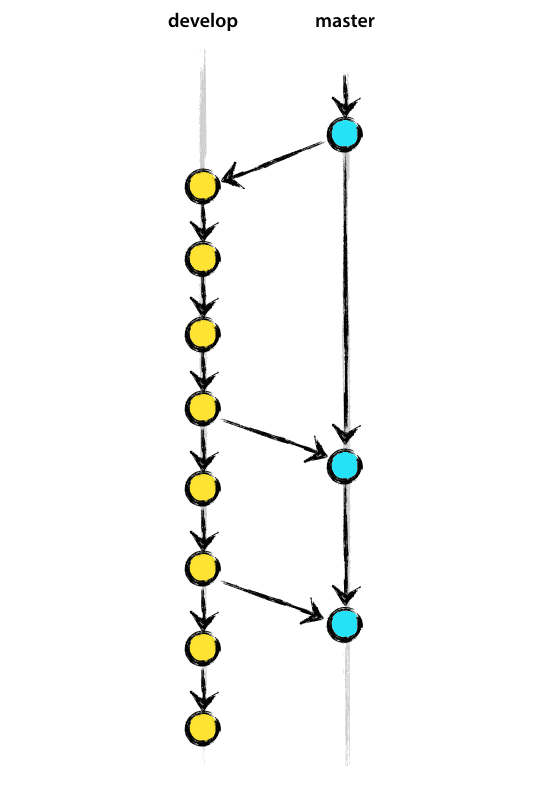

# Git连接问题

## git clone github 无法连接

1. 查询git公网ip(https://www.ipaddress.com/),获得github.com、github.global.ssl.fastly.net、codeload.github.com三个域名的公网ip

2. sudo vim /etc/hosts,加入公网ip与域名

   ```
   140.82.113.4 github.com
   199.232.5.194 github.global.ssl.Fastly.net
   140.82.114.9 codeload.github.com
   ```

3. 保存并退出

## git 取消代理

```bash
git config --global https.proxy http://127.0.0.1:1080

git config --global https.proxy https://127.0.0.1:1080

git config --global --unset http.proxy

git config --global --unset https.proxy
```


# Git基础

## 版本管理

### 什么是版本管理

版本管理是一种记录文件变化的方式，以便将来查阅特定版本的文件内容。


### 人为维护文档版本的问题

1. 文档数量多且命名不清晰导致文档版本混乱

2. 每次编辑文档需要复制，不方便

3. 多人同时编辑同一个文档，容易产生覆盖


## Git 是什么

Git是一个版本管理控制系统（缩写VCS），它可以在任何时间点，将文档的状态作为更新记录保存起来，也可以在任何时间点，将更新记录恢复回来。


### Git 安装

[下载地址](https://git-scm.com/downloads) 

在安装的过程中，所有选项使用默认值即可。


### Git 基本工作流程

| git仓库          | 暂存区             | 工作目录            |
| ---------------- | ------------------ | ------------------- |
| 用于存放提交记录 | 临时存放被修改文件 | 被Git管理的项目目录 |


## Git 的使用

### Git 使用前配置

在使用 git 前，需要告诉 git 你是谁，在向 git 仓库中提交时需要用到。

1. 配置提交人姓名：`git config --global user.name 提交人姓名`
2. 配置提交人姓名：`git config --global user.email 提交人邮箱` 
3. 查看git配置信息：`git config --list`   

**注意**

1. 如果要对配置信息进行修改，重复上述命令即可。

2. 配置只需要执行一次。

### 提交步骤

1. `git init` 初始化git仓库
2. `git status` 查看文件状态
3. `git add 文件列表` 追踪文件
4. `git commit -m 提交信息`  向仓库中提交代码
5. `git log` 查看提交记录


### 撤销

- 用暂存区中的文件覆盖工作目录中的文件： `git checkout 文件`

- 将文件从暂存区中删除： `git rm --cached 文件`
- 将 git 仓库中指定的更新记录恢复出来，并且覆盖暂存区和工作目录：`git reset --hard commitID` 




## Git进阶

### 分支

为了便于理解，大家暂时可以认为分支就是当前工作目录中代码的一份副本。

使用分支，可以让我们从开发主线上分离出来，以免影响开发主线。


### 分支细分

1. 主分支（master）：第一次向 git 仓库中提交更新记录时自动产生的一个分支。

   

   

   

2. 、开发分支（develop）：作为开发的分支，基于 master 分支创建。

   

   

3. 功能分支（feature）：作为开发具体功能的分支，基于开发分支创建

   

   

**功能分支 -> 开发分支 -> 主分支**

### 分支命令

- `git branch` 查看分支

- `git branch 分支名称` 创建分支

- `git checkout 分支名称` 切换分支

- `git merge 来源分支` 合并分支

- `git branch -d 分支名称` 删除分支（分支被合并后才允许删除）（-D 强制删除）


### 暂时保存更改

在git中，可以暂时提取分支上所有的改动并存储，让开发人员得到一个干净的工作副本，临时转向其他工作。

使用场景：分支临时切换

- 存储临时改动：`git stash`
- 恢复改动：`git stash pop`
